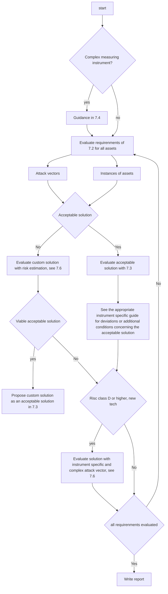

# WELMEC instroduction and use of software guides

```mermaid
flowchart
    S1[start]
    S1 --> CMS{Complex measuring instrument?}
    CMS --> |yes| G74[Guidance in 7.4]
        G74 --> G72
    CMS --> |no| G72[Evaluate requirenments of 7.2 for all assets]
        G72 --> AV[Attack vectors]
        G72 --> IOA[Instances of assets]
        AS{Acceptable solution}
        AV --> AS
        IOA --> AS
        AS --> |No| G76[Evaluate custom solution with risk estimation, see 7.6]
            G76 --> VAS{Viable acceptable solution}
                VAS --> |yes| PCS[Propose custom solution as an acceptable solution in 7.3]
                VAS --> |No| RCD
        AS --> |Yes| EAS[Evaluate acceptable solution with 7.3]
            EAS --> SSG[See the appropriate instrument specific guide for deviations or additional conditions concerning the acceptable solution]
            SSG --> RCD{Risc class D or higher, new tech}
            RCD --> |yes| G76-1[Evaluate solution with instrument specific and complex attack vector, see 7.6]
                G76-1 --> ARE
            RCD --> |No| ARE{all requirenments evaluated}
            ARE --> |No| G72
            ARE --> |Yes| WR[Write report]
```
